## Final Report -- May 5, 2016
**Table of Contents:**
- [Overview](./finals_report.md#overview)
- [Scientific Questioning](./final_report.md#scientific-questioning)
  - [Descriptive Analysis](./final_report.md#descriptive-analysis)
  - [Exploratory Analysis](./final_report.md#exploratory-analysis)
  - [Inferential Analysis](./final_report.md#inferential-analysis)
  - [Predictive Analysis](./final_report.md#predictive-analysis)
  - [Testing Assumptions](./final_report.md#testing-assumptions)
  - [Extended Exploratory Analysis](./final_report.md#extended-exploratory-analysis)
    - [Building a Model](./final_report.md#building-a-model)
    - [Orienting Ourselves](./final_report.md#orienting-ourselves)
    - [Trends in Synaptic Density](./final_report.md#trends-in-synaptic-density)
    - [Imaging our Data](./final_report.md#imaging-our-data)
- [Methods](./final_report.md#methods)
  - [Descriptive Analysis](./final_report.md#descriptive-analysis-1)
  - [Exploratory Analysis](./final_report.md#exploratory-analysis-1)
  - [Inferential Analysis](./final_report.md#inferential-analysis-1)
  - [Predictive Analysis](./final_report.md#predictive-analysis-1)
  - [Testing Assumptions](./final_report.md#testing-assumptions-1)
  - [Extended Exploratory Analysis](./final_report.md#extended-exploratory-analysis-1)
    - [Building a Model](./final_report.md#building-a-model-1)
    - [Orienting Ourselves](./final_report.md#orienting-ourselves-1)
    - [Trends in Synaptic Density](./final_report.md#trends-in-synaptic-density-1)
    - [Imaging our Data](./final_report.md#imaging-our-data-1)
- [Next Steps](./final_report.md#next-steps)
- [Conclusion](./final_report.md#conclusion)

----------
### Overview
Our dataset is taken from the 2011 *M. musculus* V1 dataset from *Network anatomy and in vivo physiology of visual cortical neurons* (Bock et al)[1](f-dbock). The raw dataset was over 30 TB and was further processed resulting in an EM volume representation of the data. Our synaptic density data is a result of downsampling the EM data through synapse characterization algorithms and spatial reduction. Our dataset consists of (x,y,z) coordinates, the number of synapses at that point and the unmasked value for that region.

### Significance
Synapse connectivity is vital to understanding neural circuits in the cerebral cortex. Synaptic density may be a strong indicator characteristics of neuron networks in the cortex. Specifically, patterns in synaptic density can illuminate features within cortical layers and throughout cortical layers that may be significant to understanding the overall structure of the cortex. Combined with information about neural functioning, an understanding of cortical structure may be useful for studying etiology of mental illnesses with known cortical defects as well as diseases that plague the cerebral cortex. With our data,  we can analyze the spatial distribution of synapses in a sample of the cerebral cortex with the goal of understanding synaptic density patterns within the cortex.

### Scientific Questioning
We will discuss our analysis of the synapse density data, starting with exploratory and descriptive analysis, through hypothesis testing and regression, and ending with extended exploratory analysis inspired by previous results. The questions posed are followed by their outcomes.

#### Descriptive Analysis
We began by seeking some basic understanding of this data. To understand the structure of our data, we first asked questions regarding charachteristics of the data such as dataset size and shape, number of total synapses, and number of invalid (i.e. unmasked value = 0) data points were present in our data, what a histogram of the synapse density looks like. Below are the results of these questions.

|Query|Synaptic Density Dataset|
|-------|-----------------|
|Dataset Size/Shape|(61776, 5)|
|Total Synapses|7704178|
|Invalid data points|6595|

> 
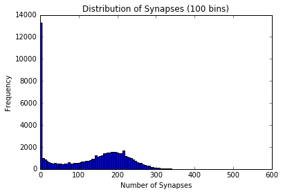

> 
<small><b> </b>
Synapse distribution of whole data set. We notice a very large number of voxels with 0 synapses. Many of these get removed after removing magins from dataset and removing points with an unmasked value of 0.</small>

> 
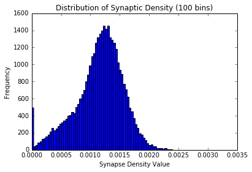

> 
<small><b> </b>
Synaptic density distribution of whole data set after data set "cleaned" by removing margins. We notice most data points represent a "medium-density" area. The medium-density area is more common than low or high density areas. </small>

Another descriptive question asked regarded the meaning of the unmasked variable. After consulting with those familiar with the dataset who have an understanding of how the data was collected, we were able to gain an understanding of the meaning of the variable. The unmaksed value was a way to differentiate between boundary regions and those regions missing data from good-quality regions of data when the data was processed. The mask represents regions which are to be ignored and are not meaningful data. Data points with an unmasked value of zero are regions considered insignificant. More specifically, the unmasked value represents the number of voxels in that row which have meaningful data.

> 
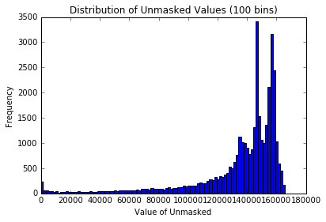

> 
<small><b> </b>
Unmasked value distribution of whole data set. We notice a large number of points with an unmasked value of 0. This means a lot of daata is going to be ignored. The larger spikes toward the right of the graph indicate that, though a lot of data is insignificant due to a zero unmasked value, a large portion of the data has a high unmasked value and is meaningful. </small>

Naturally, we suspected a relationship between the unmasked value and number of synapses at a given coordinate, and as such, tested for the correlation between the two. The correlation  between the unmasked value and number of synapses at a coordinate is 0.89621769.

The final descriptive question asked regarded clustering of the data. We suspected a natural clustering of synapses to be present, and
thus we produced a scatter plot of the data to get a general idea of how the synapses are clustered and the structure as a whole.

> 
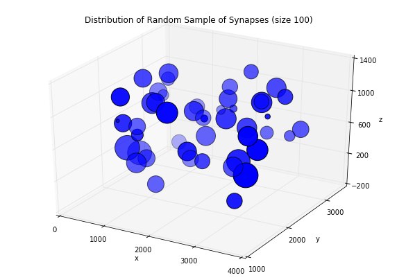

> 
<small><b> </b> Scatter plot of a random sample of 100 points in our data set. (x,y,z) points are plotted with the marker size weighted by number of synapses. </small>

#### Exploratory Analysis
Knowing what the unmasked value is, we could remove invalid data entries where unmasked values were zero. With the remaining data, we sought to gain a general understanding of how the synapses are structured in the sample. Thus we asked how the data could be clustered and which metrics should be used to cluster the synapses. We used k-means, varying k-values. In terms of which metrics to be using, since we're dealing with objects in 3D space, Euclidean distance is the obvious choice. These results are displayed below.

> 

> 

We ran k-means clustering with 4, 5, and 10 clusters and found that 4 clusters looked the most well organized and naturally structured
out of those options. Our main goal in running the k-means clustering algorithm at this point was to see if there is any sense of
natural clustering in the data and whether or not it was visible and apparent. Later, we return to clustering where we find the optimal number of clusters of synapses for the dataset.

We also asked about the values of mean of the probability mass function (f: R^3→[0, 1] where f(x, y, z)=probability that a synapse exists at (x, y, z)). The mean is 1.61875161875e-05.

To gain a better understanding of the limits of our dataset, we asked about the bounds of our (x,y,z) coordinates and the maximum number of synapses that occur at any one coordinate. The results are tabulated below.

|Query| Syn Density Dataset|
|-----|--------------------|
|Min/Max x-value|1369/3358|
|Min/Max y-value|55/1165|
|Min/Max z-value|0/165789|
|Max number of synapses at one point|33450|
|Point at which max number of synpases occurs|(2749.0, 1876.0, 1054.0)|

#### Inferential Analysis

We can use statistical inference techniques to determine whether or not synaptic density is uniform throughout the 3D volume in the data. We will run a Chi-Squared test to determine whether or not to reject the null hypothesis that synaptic density is uniform throughout the volume. The Chi-Squared test will compare the number of synapses per bin in the data given, to the expected number of synapses under the null hypothesis. The expected number of synapses can be calculated by first computing the average synaptic density (synapses/unmasked for each row) and then multiplying unmasked by this average density value for every row. The Chi-Squared test returned a p-value of approximately 0, meaning that we can reject the null. I.e. synaptic density is *not* uniform throughout the volume.

> 

> 
<small><b> </b>The histogram of synaptic density clearly shows a non-uniform distribution of synapses in our sample. We see that medium-density areas are more common than low or high density.</small>

This plot further demonstrates the result obtained from the Chi-Squared test: synaptic density is non-uniform.

#### Predictive Analysis
Now we can explore the relationship between spatial coordinates and synaptic density. We do this by running several regression algorithms, with spatial coordinates as the regressor, and density as the regressand. Regression algorithms, initially given somewhat arbitrary and/or default values for hyperparameters, were trained and tested using 10-fold cross-validation. Results are tabulated below:

| Regression | R^2 | Standard Error |
|------------|----------|--------------------|
|K-Nearest Neighbors| 0.20 | +/- 0.08 |
|Linear SVR| -0.49 | +/- 1.36 |
|Linear Regression | 0.12 | +/- 0.16 |
|Random Forest| 0.21 | +/- 0.13 |
|Polynomial Regression| 0.18 | +/- 0.17 |

R^2 value per regression is, at best,
0.21, and, at worst, -0.49. From the poor results of standard linear and linear support vector regression,
we see that the relationship between spatial location and density is most likely
non-linear. Observe that the most sucessful regression algorithms were Random Forest and KNN regressions. To investigate these further, optimal hyperparameters were estimated, and then the algorithms were re-ran using said parameters (see methods for further info). Results tabulated below:

| Regression | R^2 | Standard Error |
|------------|----------|--------------------|
|K-Nearest Neighbors| 0.24 | +/- 0.08 |
|Random Forest| 0.28 | +/- 0.09 |

While we do note some improvement, in both R^2 and error, it appears that ultimately these regressions were still unsucessful. To gain more understanding of why
the regression algorithms performed the way they did, we reevaluated our procedure thus far and tested our assumptions.
This is explained further in the Testing Assumptions and Next Steps sections.

#### Testing Assumptions
The prior analyses all made the assumptions that our data was i.i.d (identically and independently distributed). Here we test whether or not such assumptions were actually true.

First we will look at the identical assumption. As mentioned previously, in our exploratory analyses, we did notice some clustering, so it was likely that the data was infact not identically distributed. We more formally investigate this now. We did GMM clustering on the data, and plotted the BIC against the number of clusters.

> 

> 
<small><b> </b>We notice an elbow at 4 clusters, so we conclude that this is a good suggestion for the optimal number of clusters.</small>

Thus we concluded that our assumption of identical distributions was false. Also note the spike at 11 clusters: we hypothesize that this is due to the fact that there are 11 possible z-values.

Now we will investigate the independence assumption. To do this we can look at the sample-covariance matrix of our data. Since our data set was so big, doing this for all the data at once is infeasible. Instead we randomly sample from the data many times, taking the sample covariance for each of these random samples. Then we finally average these covariance matrices (element-wise).

> 

<small><b> </b>Sample covariance matrix for an average of many random samples of our data. Covariance is highly concentrated along the diagonal. </small>

Here we see that the covariance was highly concentrated along the diagonal, indicating that the data was in fact independently distributed.

### Extended Exploratory Analysis
#### Building a Model

We use k-means clusetering on the data, scaling the densities up so that they have a greater effect on the clustering. We calculated the maximum and minimum vvalues for clusters of synaptic density. There was a clean partitioning of the density ranges with little overlap.

|Cluster | Minumum | Maximum |
|--------|---------|---------|
|1| 0.0014 | 0.0033 |
|2| 0.0006 | 0.0011 |
|3| 0 | 0.0006 |
|4| 0.0011 | 0.0014 |

Next, we used four Poissons to model synapse count in the data based on the results of the clustering above. For each cluster, average synapses was determined and then these were used as lambda values for a Poisson distribution with one distribution per cluster. The table below compares statistical characteristics of the true data to the simulated Poisson data.

|------| Mean | Median | Standard Deviation |
|--------------|------|--------|--------------------|
|True Data|  | 163 | 174 | 69 |
|Simulated Data| 163 | 178 | 64 |

The mean, median and standard deviatio of the simulated data are close to that of the true data. To decide whether the model was an accurate representation of the true data, we determined goodness of fit the models using a Chi-Squared test.
A low p-value of approximately 0 for the Poisson model indicates that the model is a poor representation of the true distribution. This is likely due to the relatively high within-cluster variance in densities. 

#### Orienting Ourselves
The margins of our data were cut out per suggestion of the instructor. The sample is "rough around the edges" due to either the physical sample being imaged having rough edges or as an artifact of the processing the raw data went through to get the downsampled synaptic density data we are analyzing. One we excluded the margins from the data, we analyzed our data to determine the orientation of the volume in the 3D cortical space. We do this through analyzing trends in synaptic density in which we found evidence for cortical layers in the y-direction. From the Bock paper, we see that the imaged region of the cortex included cortial layers 1, 2/3, and upper 4. This, along with our evidence for y-layers indicates that the y-layer of highest density is likely part of cortical layer 1 (the cortical layer with the highest cell density and thus highest synaptic density). Moving from layer 1 of the cortex (the highest density region of our data) to deeper layers along the y-axis is thus the same as moving deeper into the cortex.

> 

> 
<small><b> </b>
From http://viz.neurodata.io/project/bock11/#, we overlaid the 'mp4merged' synapse data over our dataset.
Y from top to bottom. X from left to right. We see increasing synaptic density as y increases. We see a band of high density
at the top which we beleive to be a portion of layer of of the cortex defined above the red line. </small>

#### Trends in Synaptic Density
We see evident signs of cortical layering in the y-direction defined by density local minima.
> 
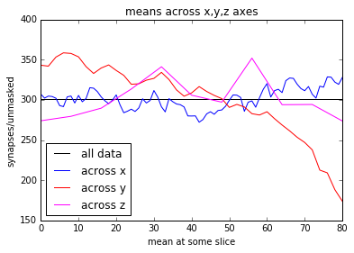

> 
<small><b> </b>We are plotting the mean the x-z plane at each y coordinate value. We see local maxima that are steadily decreasing as y increases.The local minima define boundary points between cortical layers. With these definitions, we see 4 layers present. </small>

> 
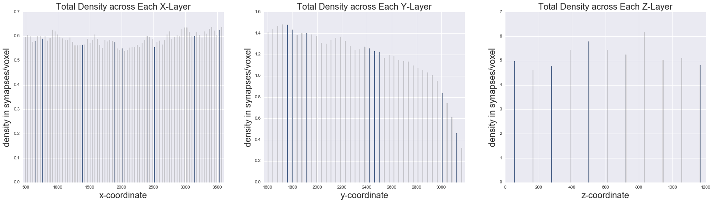

> 
<small><b> </b>Similar to the figure above, we are plotting the total number of synapses in every x-z plane for a specific y-value. We see the same wave pattern across y indicating cortical layers with cortical depth increasing with increasing y.</small>

> 
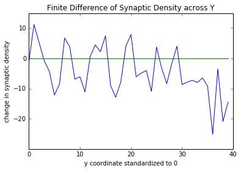

> 
<small><b> .</b>The magnitude of the changes in synaptic density across y are evident. The changes in synaptic density represent moving from one layer to the next across y. The first 4 "spikes" or "hills" are the most well-defined and represent the 4 cortical layers we believe to be present in our volume. </small>

> 
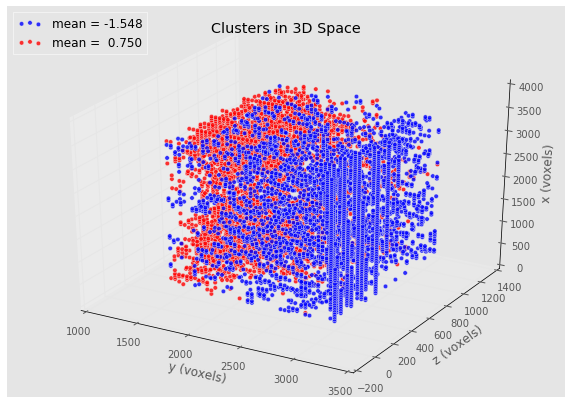

> 
<small><b> </b>We see trends in clusters across the y-level sets. The maximum density red cluster and the minimum density blue cluster have strong variations in y. The ratio of red-to-blue is highest at smaller values of y and decreases to a minimum at the highest value of y. There is an obvious gradient of high-low density across y, giving more evidence for our suggestion of the cortical layers spanning the y-coordinates. </small>

This is strong evidence for the regions between local minima across the y-coordinates being cortical layers. The local minima defining the supposed cortical layer boundaries are the y-coordinates: 1837, 2071, 2305, 2539.

There are no obvious or interesting trends along x or z in the above figures.

> 

> 
<small><b> </b>The distribution within 2 clusters fit the same distributional shape of the entire data set, while the other two are skewed. However, the final cluster has a disproportionate amount of zero values, likely due to the data not being . </small>

#### Imaging our Data

It seems that the coordinates in our data set line up with the viz.neurodata coordinates at resolution 5. To demonstrate why this seems likely to be true, markers have been placed at (0, 0), (4192, 0), (0, 3358), (4192, 3358)--i.e. corners of the boundary--and an image of these markers at resolution 8 is shown below.

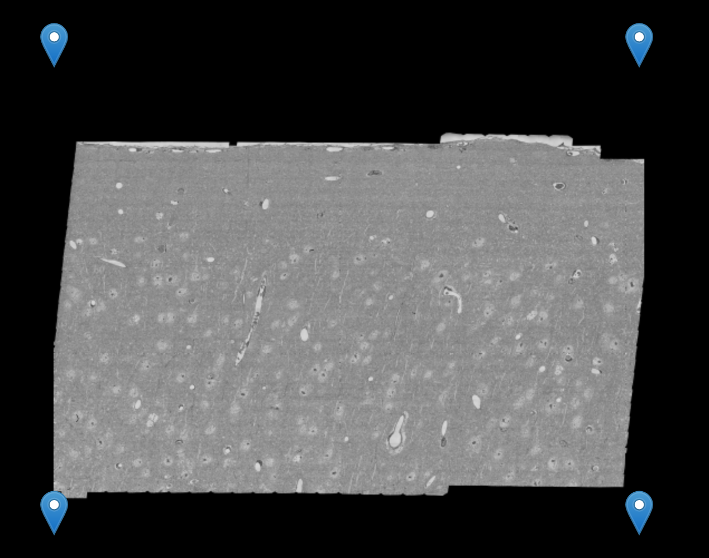

Inspecting the JS/html more we see that the actual number of pixels at resolution 5 is 4232x3744, and as we decrease resolution the pixels are doubled. Assuming the data coordinates mark bin centers (to explain the offset of the initial x).

Now we just need to figure out z-axis. The z values in the image data go from 2917-4156, which is a range of 1239. So it seems that the z-values in the data correspond to the z-values in the image data, other than a translation of 2917. Some python functions were written to get the image for a given bin and return it as a numpy array; additionally the code can grab the overlaid synapse annotation (the python module can be seen here: [**``code/image_scraping_jay.py``**](../code/image_scraping_jay.py) ).

Using these image functions, we can explore some of qualitative features of our data set. For example, we can look at what the bin with maximal synapses looks like (note that this is only one "z-slice" of that bin, since each bin actually contains 111 slices):

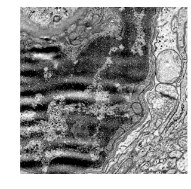

Now we can also view the overlaid synapse markings for this bin:

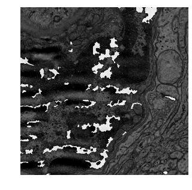

Another interesting thing we can visualize is the unmasked value across an entire xy-plane of data. The following image visualizes this as follows: the 'brightness' of a bin is determined by its unmasked value, that is, bins with very low unmasked will be dark (if 0, completely black) while bins with maximal unmasked values will be unaffected. This gives us a very broad, general idea of what types of areas the masking algorithm tends to affect the most.

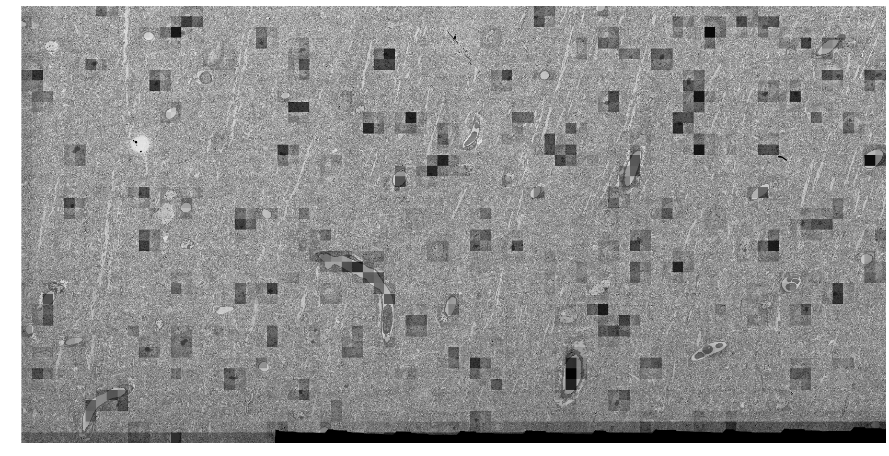

We observe that the masking algorithm tends to be most active around the border and around things that appear to be cell bodies or possibly mitochondria. Regardless, we can see that the masking algorithm is working as expected, since it makes sense to disregard things like cell bodies or mitochondria when looking for synapses.

### Methods

Code and mathematical theory for all questions is provided in detail for each analysis in the following notebooks.

| Question Type | Code |
|---------------|------|
| Descriptive | [**``code/descriptive_exploratory_answers.ipynb``**](code/descriptive_exploratory_answers.ipynb) |
| Exploratory | [**``code/descriptive_exploratory_answers.ipynb``**](code/descriptive_exploratory_answers.ipynb) |
| Inferential | [**``code/inferential_simulation.ipynb``**](code/inferential_simulation.ipynb) |
| Predictive  | [**``code/regression_simulation.ipynb``**](code/regression_simulation.ipynb) |
| Testing Assumptions | [**``code/test_assumptions.ipynb``**](code/test_assumptions.ipynb) |
| Building Model | [**``code/data_modeling.ipynb``**](code/data_modeling.ipynb) |
| Trends in Synaptic Density| [**``code/syn_density_trends.ipynb``**](code/syn_density_trends.ipynb)
| Imaging Data | [**``code/image_analysis.ipynb``**](code/image_analysis.ipynb) |

#### Descriptive Analysis

Here we were looking for numbers and figures that summarize our dataset well. We looked at total number of synapses, made a histogram of synaptic density, calculated correlation between unmasked and synapses, and made a 3D-scatterplot of the data, in order to gain some intuitive sense of how our data looks in Euclidean space. We could have additionally done these computations accross each z-slice, instead of just for the entire data set, as this might have given us some value information on how the data varies across slices.

#### Exploratory Analysis

One thing we investigated here was how the data was clustered. We ran the k-means algorithm for several different values of k and then plotted the data, coloring it based on clusters. This gave us some intuitive sense of how the data could/should be clustered, although we did not examine what the optimal number of clusters might've been (although we did do this later). We also looked at the min and max values for the positions, and also where the maximum number of synapses occured. Another interesting thing that we could have done was to look at where this maximum number occurs for each z-slice and then we could see how this position changes across z-slices.

#### Inferential Analysis

Here we used a Chi-Squared test to determine if the probabiity density per bin was uniform. To do this we compared synapse counts with expected synapse counts. Expected synapse count for each bin was computed by multiplying that bins unmasked with the average density across the entire data set. To prove that a Chi-Squared test should work in this case, we simulated data under the null and alternate and plotted power as samples increased.

#### Predictive Analysis

Here we try to predict synaptic density given spatial coordinates. We ran Linear Regression, Support Vector Regression (SVR), K-Nearest Neighbor Regression (KNN), Random Forest Regression, and Polynomial Regression, all with fairly arbitrary and/or default sklearn parameters.To show that these regressions should infact be fairly effective on our data, we ran them on simulated data similar to ours, and then plotted the coefficient of determination (we used 10-fold cross-validation to determine the std-dev). 

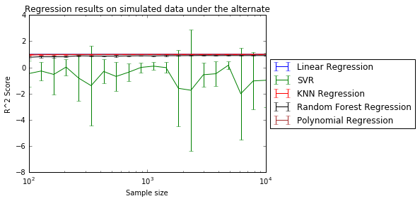

We then found better hyperparameters for the two most sucessful algorithms. Initially for KNN, the number of neighbors was set to 10. We plotted R^2 values computed via 10-fold cross validation across different values for the number of neighbors parameter in order to determine an optimal value:

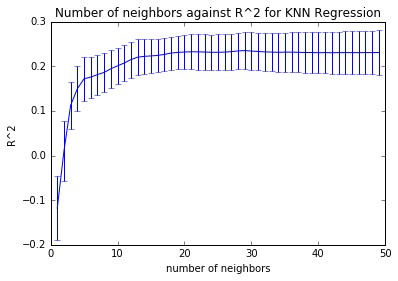

From this analysis we determined an optimal number of neighbors was 30, as opposed to the initial 10. 

For random forest, a similar analysis was done for the max depth hyperparameter:

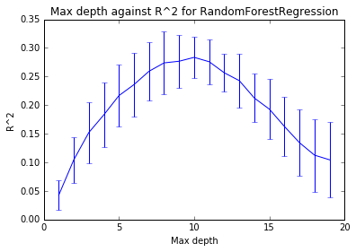

Leading us to conclude the optimal max depth was 10, and not 5 as it was initially.

#### Testing Assumptions

To test independence, we looked at the sample covariance matrix. This means we were just looking at linear independence. So while we said that by looking at the sample covariance matrix, we were concluding that the data was independent, we actually are only determining that it is not linearly independent. That being said, lack of linear independence is still a strong indicator of an overall lack of independence.

To test identical distributions, we ran a GMM for different numbers of clusters and then plotted the BIC (Bayesian Information Criterion) for each. We looked for an elbow in the plot of BIC against # of clusters to determine the optimal one. This turned out to be 4. Interestingly, there is also a high spike at 11 clusters, but we attribute this to the fact that there are 11 z-slices.

#### Extended Exploratory Analysis

##### Building a Model

The model will be as follows: for each block of space (that is row of data) the number of synapses follows a binomial distribution with parameters p=synapses/unmasked and n=unmasked, so data generated by this model will have the same set of coordinates and unmasked values as the true data but number of synapses will differ. Since the number of 'trials' (unmasked voxels) is so high, it may be necessary to approximate the binomial distributions with Gaussians or Poissons, since I'd think that computing binomial random variables would be much more computationally expensive than Gaussian or Poisson random variates. Furthermore, the Poisson distribution seems especially fitting here since all probabilities are extremely small (even the largest being less than 1%.) Based on preliminary simulations (see corresponding notebook), it seems that all 3 distributions behave pretty similarly (as expected). For now I'm going to stick with using Poisson distributions because they're nicer mathematically than the binomial and a Poisson is discrete, unlike a Gaussian. Since we are simulating discrete data, i.e. number of synapses, Poisson seems more appropriate.

Under our theoretical model, the variances are known, so using an estimate is not needed. That is, we have that

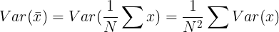

we know the theoretical variance of all of our random variables, since each *S**i* ∼ Pois(*s**i*), where *S**i* corresponds to synapses and *s**i* observed synapses. Thus the variance of the density will be *s**i*/(*u**i*)2 where *u**i* is unmasked.

This originally proposed model is obviously quite complicated, since we treat each bin as a seperate distribution. So we'll try to make a simpler, yet hopefully still accurate, model. We can use k-means clustering on the data, but scale the densities up so that they impact the clustering more.

Using the mean synapses in each cluster, we can generate lambda parameters for 4 different Poisson distributions, for each cluster, respectively.

After creating this simplified model, Chi-Squared goodness-of-fit tests were run comparing data sets generated by the simple model with the true data as well as data sets generated by the complex model. As expected, the Chi-Squared test for the complex model returned an extremely high p-value (>.99), unfortunately, for the simple model, the p-value was approximately 0, indicating that the data generated by the model was not similar to the true data. So ultimately we conclude that this is not a good way to model our data. 

Given more time, we would like to research models for spatial data (e.g. "Point Processes", and more specifically, the "Poisson Point Process").
##### Orienting Ourselves

To clean our data, we simply looked at the image of the dataset and cut off the margins where the data did not look consistent. Comparing our analysis for synaptic density patterns to the information in the Bock paper referenced in the overview, we confirmed that we were able to see some of the cortical layers. To determine which direction moves deeper into the cortex, we referenced general knowledge of the cortex. Namely, that the first cortical layer has the highest cell density and that as you move deeper into the cortex, the cell density decreases. With this information, we concluded that cortical "depth" moves downward along the y-axis.

##### Trends in Synaptic Density

The first evidence of cortical layers we saw was from looking at the average synaptic density along each axis. The average synaptic density of each 2D plane along one axis was computed and the x, y, and z coordinates were standardized to zero for the sake of comparison. It was found that there was a wavelike trend along the y-axis. We further explored by doing the same computation but with total synapses instead of synaptic density. This is because total number of cell bodies is relevant in distinguishing between cortical layers. Again, the wavelike pattern was noticeable. Both analyses showed four distinct layers along the y-direction. We then obtained a clearer picture of the boundaries between the layers we saw. The finite difference of synaptic density across the y-direction was calculated, and we were able to see the changes in synaptic density representative of moving between the layer boundaries. Finally, we performed GMM clustering on the data for four clusters. The hyperparameter for GMM (four) was determined by the elbow of a BIC curve score for clustering. The clusters with the minimum and maximum mean were plotted. The highest and lowest density clusters occupied the ends of the data set (filling the X-z planes at the uppermost and lowermost y-boundaries). This is what we expected to see. Between the ends, there is a gradient of high-low density. Moving from one end of the y-axis to the other (highest density to lowest density), there is a diffusion of the points in the high density cluster as you move closer to the low density cluster.

##### Imaging our Data

As mentioned previously, an isomorphism between the coordinates in the data set and coordinates in the viz.neurodata tool were determined through inspection. It was found that coordinates line up such that the datasets coordinates correspond to the centers of bins with height and width 39 and depth of 111 at resolution 5 on the visualizer (this resolution only impacts the xy-plane). See the corresponding ipython notebook for further details. Additionally, source code for pulling image data for a specific bin from the web and converting into a numpy array can be seen in this python module: [**``code/image_scraping_jay.py``**](../code/image_scraping_jay.py)

### Next Steps
Given more time, we would like to research models for spatial data (e.g. "Point Processes", and more specifically, the "Poisson Point Process”), and then try to apply methods from this area of statistics in order to generate a more successful model. With a model, we could obtain the data set at a full resolution allowing us to view our data at a lower level (i.e. not binned/downsample). This would allow us to analyze synaptic patterns and compare to patterns we have found in the simplified data set as well as known structures in the cortex. (i.e. what the Bock (2011) paper calls synaptic connections). The synapse coloring overlay that goes along with our dataset may color synapses according to some characteristic. We would like to see if the coloring is meaningful (or just for making the image data more readable), and, if it is meaningful, we would want to try to charachterize the distribution of synapses per color. The Bock (2011) paper mentions being able to distinguish between excitatory and inhibitory within our data set. This would give us a way to tie our analysis of the structure of the brain sample (with respect to synapses) to functionality. Tying in structure to functionality would be a long-term goal.

### Conclusion
 The patterns we saw in synapse density across our volume are significant. Our evidence for the cortical layers in y-direction is confirmed by the Bock 2011 paper: "After finding the calcium-imaged region of the cortex...each section was...tall enough (350 μm) to include cortical layers 1, 2/3 and upper 4" (Bock et al)[1](f-dbock). The analysis we performed to come to the conclusion of the direction of cortical "depth" is a step toward understanding how synapse connectivity is related to cortical layers. The analysis is a strong foundation for further exploration into structural synapse patterns within the cortex. These patterns may be strong indicators of the overall patterns in the neural structure of the cortex.
